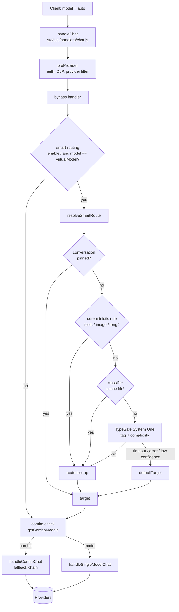

# Smart Routing with TypeSafe System One — Plan

Branch: `feature/system-one-routing` (from `master`)

## 1. Goal

Pick the most suitable model automatically for each request by classifying the prompt
into a **tag** (and a **complexity** level) and mapping that tag to a combo or a
`provider/model`. The goal is to use expensive models only where they matter, keep
cheap models for simple traffic, and never make routing the reason a request fails.

Classification uses [TypeSafe System One](https://docs.typesafe.ai/concepts/system-one)
(`Choice` questions, model `jev-latest`) behind a layer of free, deterministic rules.

## 2. Current state (summary)

- Entry point: `POST /api/v1/chat/completions` -> `handleChat` in `src/sse/handlers/chat.js`.
- `body.model` is resolved as a combo name or a `provider/model` string. Combos
  (`open-sse/services/combo.js`) are ordered model lists (fallback or round-robin) and
  know nothing about the prompt.
- There is no routing tag concept. `/api/tags` is only the Ollama-compatible model list.
- Settings live in a JSON row (`src/lib/db/repos/settingsRepo.js`, `DEFAULT_SETTINGS`).

## 3. Design

### 3.1 Virtual model

A client that sends `model: "auto"` (configurable via `smartRouting.virtualModel`) opts in
to smart routing. Any other model string follows the existing path untouched, so existing
clients are not affected. When smart routing is disabled, `auto` is not special.

### 3.2 Hook point

In `handleChat`, after `preProvider` (auth, DLP, provider filter) and the bypass handler,
and before the combo check:

```
preProvider -> bypass -> [smart routing: rewrite modelStr] -> combo check -> single model
```

Smart routing only rewrites `modelStr` to a combo name or `provider/model`. All fallback,
credentials, rate-limit and logging logic downstream is reused as is.

### 3.3 Two-stage classification

1. **Deterministic rules (free, instant)** — evaluated first:
   - request has `tools` -> tag `agent`
   - request has image parts -> tag `vision`
   - estimated input larger than `longContextChars` -> tag `long_context`
2. **System One (one HTTP call, two questions)** — for everything else:
   - `tag`: `code`, `reasoning`, `chat`, `summarize_translate`, `creative`, `other`
   - `complexity`: `low`, `medium`, `high`

   Input sent to TypeSafe is limited to the last user message and, when the conversation has
   history, the user message before it (together truncated to `maxInputChars`, latest message
   first), plus the first part of the system prompt. Nothing else is sent.

### 3.4 Route table

`smartRouting.routes` maps a key to a target (combo name or `provider/model`).
Lookup order: `"<tag>:<complexity>"` -> `"<tag>"` -> `defaultTarget`.

```json
{
  "code:high": "code-premium",
  "code": "code-cheap",
  "reasoning": "reasoning",
  "agent": "code-premium",
  "vision": "vision",
  "long_context": "long-context",
  "chat:low": "cheap-fast"
}
```

Targets are normally combos, so the existing fallback chain still protects every route.

### 3.5 Safety rules

- Classification must never block or fail a request. Timeout (`timeoutMs`, default 800),
  HTTP error, missing API key, invalid JSON or `confidence < minConfidence` all fall back to
  `defaultTarget` (or the original model if none is set).
- The API key comes from the environment or from the admin page (stored per provider in
  `decisionApiKeys`). It is write-only: never logged and never returned by the settings API.
- Smart routing runs after DLP, and can be limited to specific API keys (`apiKeyIds`).
- Classifications are cached (in-memory, bounded) by hash of the classified text. A
  **confident** decision is **pinned per conversation** (hash of API key + first user
  message), so the conversation does not switch models between turns and lose context or
  prompt-cache hits. Fallbacks (classifier error, low confidence) are **not** pinned: the next
  turn is classified again, now with more context.

### 3.6 Settings (`smartRouting`, disabled by default)

| Key | Default | Meaning |
|---|---|---|
| `enabled` | `false` | Master switch |
| `virtualModel` | `"auto"` | Model name that triggers routing |
| `provider` | `"typesafe"` | Decision provider id (see 7.1) |
| `model` | `""` | Provider model; empty = the provider default (`jev-latest` for TypeSafe) |
| `baseUrl` | `""` | Provider endpoint; empty = the provider default |
| `minConfidence` | `0.6` | Below this, use `defaultTarget` |
| `timeoutMs` | `800` | Classifier timeout |
| `maxInputChars` | `2000` | Text sent to classifier |
| `longContextChars` | `48000` | Rule threshold for `long_context` |
| `defaultTarget` | `""` | Fallback combo / model |
| `routes` | `{}` | Route table (3.4) |
| `apiKeyIds` | `[]` | Optional allow-list of API key ids (empty = all) |

API key: saved in admin (`decisionApiKeys.<provider>`) or `TYPESAFE_API_KEY`; the environment wins.

## 3.7 Architecture

### Request flow



### Components

| Module | Responsibility |
|---|---|
| `src/sse/handlers/chat.js` | Hook: detects the virtual model, calls the resolver, rewrites `modelStr`, logs the decision |
| `src/lib/smartRouting/index.js` | Orchestration: key filter, conversation pin, rules, cache, classifier call, route lookup. Never throws |
| `src/lib/smartRouting/rules.js` | Pure functions: extract signals from OpenAI / Responses / Claude / Gemini bodies, deterministic tags, route lookup |
| `src/lib/smartRouting/typesafeClient.js` | `POST /v1/systemone` (Choice: `tag`, `complexity`), timeout, response validation |
| `src/lib/smartRouting/defaults.js` | Default config and completion of partially stored config |
| `src/lib/db/repos/settingsRepo.js` | Persists `smartRouting` in the settings row |
| `open-sse/services/combo.js` | Unchanged: executes the chosen combo with its fallback chain |

### Design decisions

- **Rewrite, don't fork.** Smart routing only changes the model string, so credentials,
  rate limits, fallback, translation and usage logging are reused with no duplicated logic.
- **Fail open.** Every classifier problem ends at `defaultTarget`; only a missing target
  (no route and no default) returns a 503, with a message that names the setting.
- **Secrets stay in the environment.** `TYPESAFE_API_KEY` is read from `process.env` at call time.
- **State is per-process.** Cache and conversation pins are in-memory (bounded at 1000 entries
  each); a restart or a second instance just re-classifies. Moving them to `kvStore` is Phase 3.

## 4. Implementation phases

### Phase 1 — rules + virtual model (no external call)
- `src/lib/smartRouting/rules.js`: text extraction (OpenAI chat, Responses, Claude formats)
  and deterministic tags.
- `smartRouting` defaults in `settingsRepo.js`.
- Hook in `chat.js`, decision logged via `log.info`.

### Phase 2 — System One classifier
- `src/lib/smartRouting/typesafeClient.js`: `POST /v1/systemone` with timeout.
- `src/lib/smartRouting/index.js`: orchestration, route lookup, cache, conversation pin.
- Unit tests with `node --test` (`tests/smartRouting.test.mjs`).

### Phase 3 — observability and UI (follow-up)
- Persist tag, confidence, target and classifier latency in `requestDetails`.
- Dashboard page to edit routes/thresholds and show tag distribution and cost.
- Tune `criteria` and routes from real traffic; consider storing the cache in `kvStore`.

## 5. Risks and open points

- **Data egress:** prompt text (truncated) leaves the gateway to `api.typesafe.ai`. Keep
  it opt-in, after DLP, and restrict by API key when needed.
- **Latency and cost:** the docs give no numbers. Measure before enabling for all traffic;
  the 800 ms timeout and the cache bound the downside.
- **Mid-conversation switching:** handled by conversation pinning; clients that do not
  resend history look like new conversations and may be routed differently.
- **Invalid targets:** a route pointing at a missing combo/model fails like any bad model
  string. Validate routes when the UI is added (Phase 3).
- **Combo rotation state** is per-process memory; unrelated but relevant for multi-instance
  deployments.

## 6. Test plan

- Unit: text extraction per format, rule tags, route lookup order, low-confidence and
  timeout fallbacks, conversation pinning, cache hit.
- Manual: `model: "auto"` with plain chat, code, tools and image payloads; confirm the
  chosen target in logs; confirm a normal model string is untouched; confirm requests
  succeed with `TYPESAFE_API_KEY` unset.

## 7. Configuration guide

Smart routing is **off by default**. There is no UI yet (Phase 3); configure it through
the settings API.

### 7.1 API key: admin or environment

The key belongs to a **decision provider** (today only `typesafe`; the registry in
`src/lib/smartRouting/providers.js` is where another provider would be added). Keys are stored
**per provider id**, so a key is always paired with the provider that uses it.

Two ways to set it, both supported:

- **Admin (fastest):** Dashboard, Profile page, **Smart routing** card. Pick the provider,
  paste the key, press **Test key** (runs one real classification with that exact
  provider and key), then **Save**. The key is write-only: it is never returned by
  `GET /api/settings`; the page only shows whether a key exists and where it comes from.
- **Environment:** `TYPESAFE_API_KEY` in `.env` (restart to apply), optional `TYPESAFE_BASE_URL`.

If both are set, **the environment wins**, so a deployment can pin its secret. The card says
which one is in use. Keys saved in admin live in the settings database (not encrypted at rest),
so prefer the environment on shared or production hosts.

### 7.2 Create the target combos first

Every value in `routes` and `defaultTarget` must be an existing combo name or a
`provider/model`. Create the combos in the dashboard (Combos page) before enabling, e.g.
`code-premium`, `code-cheap`, `reasoning`, `cheap-fast`, `always-on`.

### 7.3 Enable and set routes

Use the **Smart routing** card: toggle on, set the default target (required to enable),
minimum confidence and the routes JSON, then Save.

The same through the API: `PATCH /api/settings` merges the `smartRouting` object field by
field (omitted fields keep their value; `routes` is replaced as a whole) and validates
`provider`. Keys: `{ "decisionApiKeys": { "typesafe": "<key>" } }` sets one,
`{ "decisionApiKeys": { "typesafe": null } }` removes the saved one, an empty string is ignored.

```js
await fetch("/api/settings", {
  method: "PATCH",
  headers: { "Content-Type": "application/json" },
  body: JSON.stringify({
    smartRouting: {
      enabled: true,
      defaultTarget: "always-on",
      routes: { "code:high": "code-premium", "code": "code-cheap", "agent": "code-premium", "chat:low": "cheap-fast" }
    }
  })
}).then(r => r.json())
```

`POST /api/smart-routing/test` with `{ "provider": "typesafe", "apiKey": "<optional>" }` checks a
key/provider pair (the typed key is used for that call only, never saved or echoed).

Always set `defaultTarget`. With it empty, a classifier failure on a tag that has no route
returns `503 Smart routing found no target model`.

To turn it off: switch the toggle off (or `PATCH { "smartRouting": { "enabled": false } }`).
Requests with `model: "auto"` then fail like any unknown model.

### 7.4 Use it

Send `model: "auto"` (or your `virtualModel`):

```bash
curl http://localhost:20128/v1/chat/completions \
  -H "Authorization: Bearer <api key>" -H "Content-Type: application/json" \
  -d '{"model":"auto","messages":[{"role":"user","content":"Fix this SQL deadlock"}]}'
```

Check the server log for the decision:

```
SMART_ROUTING auto -> code-premium | tag=code:high | conf=0.92 | typesafe | 412ms
```

The same decision is returned to the client as response headers (also on streaming responses):

```
X-Smart-Routing-Target: code-premium
X-Smart-Routing-Tag: code:high
X-Smart-Routing-Source: typesafe
X-Smart-Routing-Confidence: 0.92
```

`curl -i` shows them. `Target` is the combo or model that was chosen; when it is a combo, the
model that finally answered (after fallback) is not in these headers, look it up in the
usage / request logs. Judge whether routing fits by comparing tag, target and the answer
quality over a sample of real requests, and tune `routes` / `minConfidence` accordingly.

`source` is one of `rule`, `<provider id>` (e.g. `typesafe`), `cache`, `pinned`, `low-confidence`,
`key-not-allowed`, `empty-input`, or `classifier-error: <reason>`.

### 7.5 Limit to some API keys

Set `apiKeyIds` to a list of API key ids to enable it only for those keys; other keys sending
`model: "auto"` get `defaultTarget`. Empty list means all keys.

### 7.6 Tuning

| Symptom | Change |
|---|---|
| Too many `low-confidence` fallbacks | Lower `minConfidence` (e.g. 0.5) or add clearer `criteria` in `typesafeClient.js` |
| Classifier timeouts in the log | Raise `timeoutMs`; check TypeSafe latency |
| Tag costs too much / too little | Edit the route for that tag; no restart needed |
| Long prompts misrouted | Adjust `longContextChars` |
