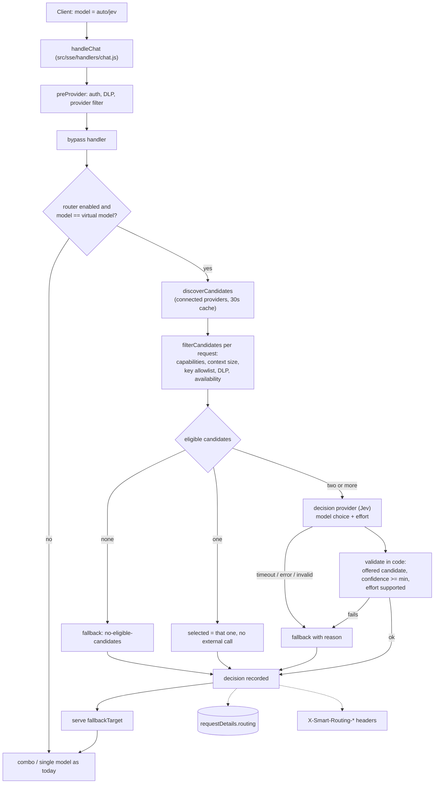

# Smart Router (Jev) — Phase 1: Shadow MVP

Issue: [finhay/llm-gateway#6](https://github.com/finhay/llm-gateway/issues/6)
Branch: `feature/system-one-routing`

## 1. What Phase 1 delivers

A native router that, for a virtual model (`auto/jev`, configurable), looks at the models the
gateway can reach **right now**, asks a decision model (TypeSafe Jev / System One) which one
and which reasoning effort fits the conversation, validates the answer in code, and **records**
it. In Phase 1 the router runs in **shadow mode**: the request is always served by a
deterministic `fallbackTarget`; the router's choice is metadata only. Nothing about the
executed model changes until a later phase turns routing on.

In scope (issue, Phase 1): one decision-provider connection, one router profile, candidate
pool, choice of model plus reasoning effort, deterministic fallback, shadow logging, offline
evaluation.

Out of scope here (Phase 2/3): executing the chosen model, applying the chosen effort to the
request, per-key rollout percentage, session stickiness, dashboard metrics, multiple profiles,
combos as candidates, feedback-driven tuning.

Design rule from the issue: **the decision model supplies a bounded semantic judgment; gateway
code owns constraints, execution, retries and fallbacks.**

## 2. Request flow



The hook only rewrites the model string to `fallbackTarget`; credentials, rate limits, DLP,
account fallback, translation, streaming and usage tracking are the existing code paths.

## 3. Candidates are discovered, not configured

The admin does not list models. The pool is built from what is reachable:

1. Active provider connections (plus no-auth free providers).
2. Each provider's built-in LLM models, custom models, and aliases of pass-through providers.
3. Minus models disabled in the dashboard.
4. Minus `exclude` patterns, restricted to `include` patterns when given, minus per-model `exclude`.
5. Metadata inferred per model:
   - **quality / latency tier** from the model name (e.g. opus, pro, thinking = high quality;
     haiku, mini, flash = low latency and lower quality),
   - **cost tier** from the model's output price, relative to the rest of the pool (unknown
     price = medium),
   - **vision** from the model family, **tools** and **structured output** assumed supported,
   - **reasoning efforts** for reasoning-capable families, limited to the profile's closed set.
6. `overrides` replace any inferred field for a model when the guess is wrong.
7. The pool is capped at `maxCandidates` (default 40), spread across quality x cost.

Compatible (custom endpoint) providers and combos are not discovered in Phase 1.

`GET /api/smart-routing/candidates` shows the current pool with the inferred metadata, and the
dashboard card renders it, so an admin can see exactly what the router sees.

### Per-request eligibility

For each request the pool is filtered again before anything is sent to the decision model:

| Reason | Meaning |
|---|---|
| `no-vision` / `no-tools` / `no-structured-output` | Request needs it, model lacks it |
| `context-too-small` | Estimated tokens exceed the model's `contextLimit` (when set) |
| `key-policy` | API key's provider allowlist excludes the provider (only for enforced keys) |
| `dlp-policy` | Provider-risk policy from `preProvider` excludes every connection of the provider |
| `unavailable` | No active connection, or all are locked for that model |

Rejected candidates are never sent to the decision model, and a choice outside the offered set
is rejected in code (`invalid-choice`), so a model excluded by policy can never be selected.

## 4. The decision

One request to the provider with two typed Choice questions:

- **model**: one of the eligible candidates; each option carries its description, quality /
  latency / cost tiers, capabilities and context size; the instructions state the optimisation
  weights.
- **effort**: one of the profile's `efforts` (default `low`, `medium`, `high`).

Input is bounded: the most recent turns up to `maxInputChars` (the newest always included) and
the first 500 characters of the system prompt. Raw prompts go to the decision provider only;
they are never logged or persisted.

Validation, in order: provider answered, choice was offered, `confidence >= minConfidence`,
effort is in the profile's set **and** supported by the chosen model (otherwise dropped, the
model choice stays).

When only one candidate is eligible the external call is skipped (`source: single-candidate`).

### Fallback reasons

The request is always served by `fallbackTarget`. `fallbackReason` explains why the router
gave no usable choice:

`no-eligible-candidates`, `low-confidence`, `timeout`, `provider-error`, `invalid-response`,
`invalid-choice`, `no-api-key`, `unknown-provider`, `key-not-allowed`, `router-error`.

The decision has its own timeout (`timeoutMs`, default 800 ms), no retries, independent of the
downstream request. In shadow mode this wait is added to the request, so `auto/jev` is opt-in and
the timeout is the upper bound of the cost.

## 5. Observability

The decision is stored on the request's `requestDetails` record under `routing`
(see `open-sse/handlers/chatCore/requestDetail.js`, `requestDetailsRepo.js`):

| Field | Meaning |
|---|---|
| `profile`, `version` | Profile name and a fingerprint of its settings |
| `mode`, `executed` | `shadow`, and the target that served the request |
| `selected`, `effort`, `confidence`, `probabilities` | The validated shadow choice |
| `suggested` | Raw choice when it was rejected (invalid or low confidence) |
| `source`, `fallbackReason` | `typesafe`, `single-candidate` or `fallback` and why |
| `pool`, `eligible`, `rejected` | Pool size, eligible ids, rejected ids with reasons |
| `decisionMs`, `usage` | Decision latency and the decision provider's token usage |

No prompt text, headers or credentials are stored. The record exists only when request
observability is enabled (existing setting).

Response headers on `auto/jev` requests:

```
X-Smart-Routing-Mode: shadow
X-Smart-Routing-Target: always-on            <- what served the request
X-Smart-Routing-Model: cc/claude-sonnet-4-6  <- model that actually answered (fallback winner in a combo)
X-Smart-Routing-Shadow-Choice: cc/claude-opus-4-7
X-Smart-Routing-Shadow-Effort: high
X-Smart-Routing-Confidence: 0.92
X-Smart-Routing-Source: typesafe             <- or fallback:<reason>
```

The server log has one `SMART_ROUTING` line per request. Dashboard charts are Phase 2.

## 6. Configuration

Dashboard: Profile page, **Smart router** card. API: `PATCH /api/settings` with `smartRouting`
(merged field by field and validated; the earlier tag and route-table settings no longer exist).

| Key | Default | Meaning |
|---|---|---|
| `enabled` | `false` | Master switch (needs `fallbackTarget`) |
| `name` | `"default"` | Profile name, stored with each decision |
| `virtualModel` | `"auto/jev"` | Model name that triggers the router |
| `mode` | `"shadow"` | Only `shadow` exists in Phase 1 |
| `provider` | `"typesafe"` | Decision provider id (registry in `providers.js`) |
| `model`, `baseUrl` | `""` | Provider model / endpoint; empty = provider default (`jev-latest`) |
| `fallbackTarget` | `""` | Combo or `provider/model` that serves every request |
| `include` / `exclude` | `[]` | Glob patterns on `alias/model` |
| `overrides` | `{}` | Per-model corrections, e.g. `{"cc/opus": {"qualityTier": "high"}}` |
| `maxCandidates` | `40` | Pool cap (2 to 200) |
| `efforts` | `low, medium, high` | Closed set of reasoning efforts |
| `weights` | `0.5 / 0.25 / 0.25` | quality / latency / cost importance |
| `minConfidence` | `0.6` | Below this the choice is not accepted |
| `timeoutMs` | `800` | Decision timeout |
| `maxInputChars` | `4000` | Conversation text sent to the decision provider |
| `apiKeyIds` | `[]` | Only these gateway keys may use the router (empty = all) |

Override fields: `qualityTier`, `latencyTier`, `costTier` (`low|medium|high`), `capabilities`
(`vision`, `tools`, `structuredOutput`), `contextLimit`, `reasoningEfforts`, `description`,
`exclude`.

### API key for the decision provider

Stored per provider id, so a key is always paired with its provider:

- **Admin:** paste it in the card, press **Test key** (one real decision on stand-in
  candidates with that exact provider and key), then Save. It is write-only: `GET /api/settings`
  returns only whether a key exists and where it comes from. Stored unencrypted in the settings
  database.
- **Environment:** `TYPESAFE_API_KEY` (optional `TYPESAFE_BASE_URL`). If both exist, the
  environment wins.

Adding a provider: register it in `src/lib/smartRouting/providers.js` with a `decide` function
that returns `{ choice, confidence, probabilities, effort, effortConfidence, usage }` or throws a
`DecisionError`.

### Turning it on

1. Create or choose the `fallbackTarget` (an existing combo is the natural choice).
2. Set the key and press **Test key**.
3. Check the model list in the card; use `include`, `exclude` or `overrides` to correct it.
4. Switch the router on. Send requests with `model: "auto/jev"`.
5. Read the headers or `requestDetails.routing` to see what the router would have chosen.

## 7. Offline evaluation

`scripts/smart-routing-eval.mjs` replays a dataset through the real decision provider and
compares the router against a fixed-model baseline, before anyone enables routing:

```bash
# 1. save the pool the router sees: GET /api/smart-routing/candidates > candidates.json
# 2. dataset.jsonl, one per line: {"prompt":"..."} or {"messages":[...]}, optional
#    "tools": [...] and "acceptable": ["cc/claude-haiku-4-5", ...]
TYPESAFE_API_KEY=... node scripts/smart-routing-eval.mjs \
  --dataset dataset.jsonl --candidates candidates.json \
  --baseline cc/claude-sonnet-4-6 [--profile profile.json] [--output-tokens 400] [--report report.json]
```

Reports: fallback rate and reasons, selection and effort distribution, confidence, decision
latency (p50 / p95), router token use, estimated cost versus the baseline (dollars when every
candidate has a price, otherwise relative tier units), latency-tier mix, and the share of labelled
prompts where the choice is in `acceptable`. Undecided prompts are costed at the baseline.
Model answer latency and quality are not measured offline: quality comes from your `acceptable`
labels and latency from the tiers. The evaluation treats every candidate as allowed and
reachable (it measures the decision, not policy).

## 8. Tests

`tests/unit/smartRouting.test.js` (vitest) covers signals and excerpt bounds, the discovered pool
(inference, include / exclude / overrides, cap), capability, size and policy filtering, the
confidence gate, invalid and filtered-out choices, every fallback path, single-candidate skip,
effort validation, no prompt text in the decision, headers, profile validation, provider keys,
and the evaluation maths. The evaluation script was also run end to end against a local stand-in
for the decision API.

Not covered yet: integration tests through `handleChat` for the Chat Completions, Responses and
Messages endpoints, streaming behaviour of the headers, discovery and policy checks against a real
database, and an end-to-end run against the real TypeSafe API.

## 9. Known limitations

- Shadow mode adds up to `timeoutMs` to each `auto/jev` request.
- Capability and tier inference is name based; wrong guesses are corrected with `overrides`.
- Combos and compatible (custom endpoint) providers are not candidates yet.
- Prompt excerpts leave the gateway for the decision provider; keep the router opt-in and
  restrict it with `apiKeyIds` where needed.
- Requests do not use the chosen model or effort yet; applying them (and mapping effort to each
  API format) is Phase 2.

## 10. Next phases

- **Phase 2:** execute the chosen model with the chosen effort, per-key enablement and rollout
  percentage, session stickiness, dashboard metrics, integration tests.
- **Phase 3:** multiple profiles by team or workload, eval-driven tuning, adaptive cost and
  latency constraints from pricing and provider health.
