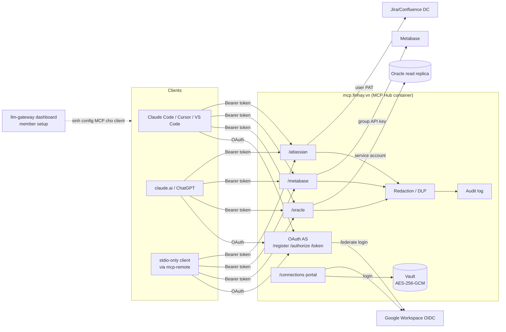
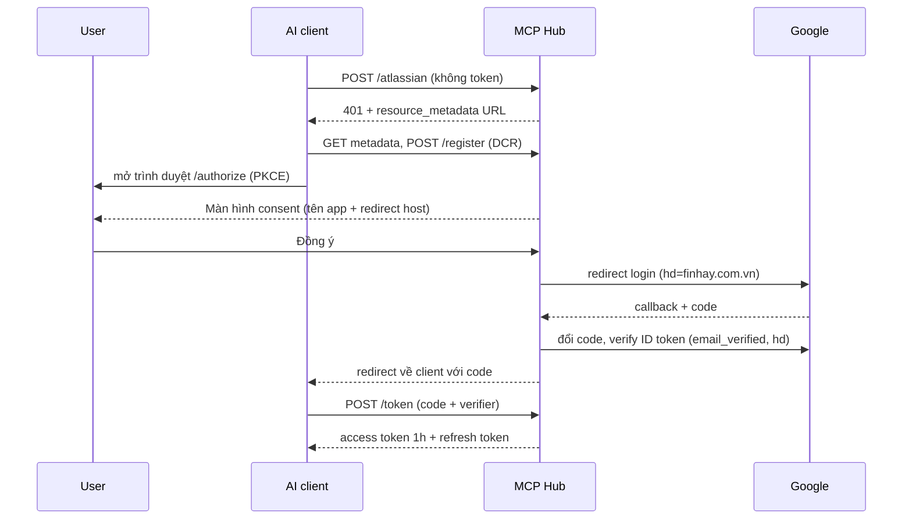

# Finhay MCP Hub — Thiết kế

_Trạng thái: Draft v0.1 · 2026-10-09 · Owner: Tuan Tran · Code: `mcp-hub/` (branch `feature/mcp-hub`)_

## 1. Bối cảnh & mục tiêu

Nhân viên Finhay (tech và non-tech) dùng nhiều AI client khác nhau (Claude Desktop/Code, claude.ai, ChatGPT, Cursor, VS Code, Codex…), phần lớn bằng tài khoản cá nhân. Không có plan Team/Enterprise, nên không dựa được vào tính năng quản trị org của vendor nào.

Cần một cách phân phối MCP, skills và agent nội bộ sao cho:

- Chỉ dùng nội bộ: chỉ tài khoản Google Workspace `@finhay.com.vn` truy cập được.
- Không yêu cầu git access hay cài runtime trên máy user.
- Setup một lần, update tự động.
- Credential của từng hệ thống được quản lý tập trung, không nằm trên laptop và không bao giờ đi qua cuộc chat.

**Mục tiêu đo được (MVP):** một nhân viên non-tech add được MCP Atlassian và hỏi được Jira trong ≤ 10 phút, không cần hỗ trợ.

## 2. Phạm vi

**Trong phạm vi:**
- Remote MCP Hub: OAuth, endpoint theo service, vault credential, audit, redaction.
- Portal `/connections`.
- Tích hợp với trang member setup của `llm-gateway`.

**Ngoài phạm vi (giai đoạn này):**
- MCP local chạy trên máy user.
- Phân phối skills.
- Thao tác ghi (write) vào hệ thống nguồn. MVP chỉ đọc.

## 3. Các quyết định chính

| # | Quyết định | Lý do |
|---|---|---|
| D1 | **Cùng repo `llm-gateway`, khác runtime**: `mcp-hub/` có package, Dockerfile, CapRover app và vault key riêng | Dùng lại portal và onboarding. Giảm blast radius: hub lỗi không kéo sập LLM routing. Không đụng core của fork 9router, nên không tăng conflict khi sync upstream |
| D2 | **Một hub, nhiều endpoint**: `/atlassian`, `/metabase`, `/oracle`, sau này thêm `/bundle/<role>` | Tránh dồn ~100 tool vào context; user chỉ add thứ cần; tắt hoặc phân quyền từng service riêng |
| D3 | **Hub là OAuth 2.1 Authorization Server, federate login sang Google Workspace** | Đúng chuẩn MCP Authorization (DCR, PKCE, RFC 8707/9728) nên mọi client hỗ trợ remote MCP đều dùng được. User không nhập password vào client |
| D4 | **Không giới hạn network.** Hub public HTTPS, bảo vệ bằng OAuth Google | claude.ai và ChatGPT gọi MCP từ cloud của vendor, chặn network thì các client này không dùng được |
| D5 | **Credential theo 3 chế độ** (mục 6) | Mỗi hệ thống có mô hình quyền khác nhau |
| D6 | **Streamable HTTP, stateless** (mỗi request tạo một McpServer mới) | Scale ngang dễ, không cần sticky session; transport SSE cũ đã deprecated |
| D7 | **Lưu trữ SQLite (`node:sqlite`) cho MVP**; chuyển Postgres khi cần HA | Không cần native build; đủ cho vài trăm user |

## 4. Kiến trúc

## 5. Các luồng chính

### 5.1 Add MCP lần đầu (mọi client)

User chỉ thấy: một màn hình "Cho phép truy cập" → chọn tài khoản Google → xong.

### 5.2 Kết nối credential: user điền khi nào, ở đâu?

**Không bao giờ điền trong chat hay trong client AI.** Credential chỉ nhập trên portal `https://mcp.finhay.vn/connections` (login Google).

- **Chủ động:** khi onboarding, vào portal → "Kết nối Atlassian" → dán PAT → hub gọi `/myself` để kiểm tra → lưu.
- **Khi cần (lazy):** user hỏi AI, tool trả về *"Bạn chưa kết nối Atlassian. Mở …/connections/atlassian để kết nối"*. User bấm link, kết nối xong rồi hỏi lại. Khi PAT hết hạn hoặc bị revoke (Jira trả 401/403), user nhận đúng thông báo này.
- **Phase 2:** dùng *URL-mode elicitation* của spec MCP để client tự mở link, với client đã hỗ trợ. Client chưa hỗ trợ vẫn dùng text link như trên.

### 5.3 Gọi tool

Request vào endpoint → verify JWT (issuer, chữ ký, hạn, scope `mcp`, audience) → lấy email từ token → giải mã credential trong vault → gọi hệ thống nguồn → redaction → ghi audit → trả kết quả.

### 5.4 Offboarding

- Access token sống 1h. Refresh token xoay vòng nhưng **tuổi đời login tuyệt đối là 7 ngày**, sau đó user bắt buộc login Google lại. Account Google bị khoá thì tối đa 7 ngày là mất quyền.
- Phase 2: đồng bộ Google Directory (job hằng ngày) để revoke ngay và xoá credential trong vault (`connections.removeAllFor(email)`).

## 6. Mô hình credential

| Chế độ | Ý nghĩa | User phải làm gì | Áp dụng |
|---|---|---|---|
| **(a) Service account** | Hub giữ một tài khoản kỹ thuật, phân quyền theo Google group ở hub | Không gì | **Oracle**: user chỉ đọc trên replica/view; allowlist schema; giới hạn số dòng và timeout; masking PII |
| **(b) Credential theo nhóm** | Admin tạo một key cho mỗi group; hub map Google group của user sang key | Không gì | **Metabase**: API key gắn với Metabase group (Data, Ops, CS…) |
| **(c) Credential cá nhân** | User tự kết nối một lần trên portal; credential được mã hoá và gắn với email | Dán PAT một lần (hoặc OAuth Allow nếu hệ thống hỗ trợ) | **Jira/Confluence DC**: PAT cá nhân, quyền đúng như của chính user |

**Vault:**
- AES-256-GCM, IV ngẫu nhiên. AAD = `email|service`, nên không thể "tráo" ciphertext sang user hay service khác.
- Key `MCP_HUB_VAULT_KEY` tách riêng khỏi llm-gateway.
- Chế độ (a)/(b): credential nằm trong env/secret của CapRover, không nằm trong DB.

**Audit:** chỉ ghi metadata (email, service, tool, ok/err, thời gian xử lý). Không ghi tham số tool, kết quả hay secret.

## 7. Catalog endpoint (dự kiến)

| Endpoint | Tools (MVP) | Credential | Phase |
|---|---|---|---|
| `/atlassian` | `jira_search`, `jira_get_issue` (đã có); `confluence_search`, `confluence_get_page` | (c) PAT | 1 |
| `/metabase` | `metabase_search`, `metabase_run_question`, `metabase_list_dashboards` | (b) group key | 2 |
| `/oracle` | `oracle_describe`, `oracle_query` (SELECT, có giới hạn) | (a) service account | 2 |
| `/bundle/data` | metabase + oracle | – | 2 |
| `/bundle/pm` | jira + confluence | – | 2 |

**Phân quyền theo group** (endpoint/bundle nào cho ai): cần Google Directory API (Admin SDK) hoặc Cloud Identity Groups. MVP mở cho mọi tài khoản `@finhay.com.vn`, vì quyền thực tế vẫn do Jira quyết định qua PAT cá nhân.

## 8. Bảo mật

| Rủi ro | Biện pháp |
|---|---|
| Tài khoản ngoài công ty | Verify ID token của Google: `email_verified` và `hd` phải thuộc allowlist (không chỉ dựa vào hint `hd` trên URL) |
| Phishing qua client đăng ký động (DCR) | Màn hình consent hiển thị tên app và redirect host, cảnh báo nếu host lạ; chỉ cho phép redirect https, http loopback hoặc app scheme |
| CSRF / login CSRF | Pending auth gắn với browser qua cookie `SameSite=Lax`; `state` dùng một lần; portal form có CSRF token trong session |
| Đánh cắp code/token | PKCE S256 bắt buộc; code dùng một lần, hạn 5 phút; refresh xoay vòng, dùng lại thì bị từ chối |
| Token dùng sai endpoint | Audience (RFC 8707): token cấp cho `/metabase` bị `/atlassian` từ chối |
| Lộ credential | Vault mã hoá; không hiển thị lại credential; không log; không bao giờ yêu cầu trong chat |
| Lộ dữ liệu nhạy cảm cho LLM | Lớp redaction cho mọi output (MVP: thẻ, bearer token, AWS key, private key). Phase 2 dùng chung detector với `src/internal/dlp`. Oracle có masking theo cột |
| Prompt injection từ nội dung Jira/Confluence | MVP chỉ đọc; tool ghi (Phase 3) phải có xác nhận và giới hạn phạm vi |
| Tài khoản cá nhân của vendor AI | **Cần Legal ban hành policy** (training/retention). Hub không kiểm soát được phía vendor |
| Abuse/DoS | Rate limit mặc định của SDK router; giới hạn body; timeout 15s khi gọi hệ thống nguồn |

## 9. Tích hợp với llm-gateway

- **Member setup** (`src/app/cli-tools/OrganizationToolSetup.js`): sinh thêm block MCP cho từng client (Claude Code `claude mcp add --transport http …`, Cursor/VS Code `mcp.json`, Codex `config.toml`, OpenCode). Một trang onboarding có cả LLM lẫn MCP.
- **DLP:** tách `src/internal/{dlp,secrets}` thành module dùng chung (bỏ alias `@/`) để hub import được.
- **Dashboard admin** (Phase 2): bật/tắt endpoint, xem audit, map group sang credential.
- **Upstream sync:** hub nằm hoàn toàn trong `mcp-hub/`, không có file core nào cần thêm vào `patch-register.yaml`.

## 10. Phase 3: MCP local và skills

- **MCP local** (chỉ cho tool thật sự cần máy user): đóng gói bằng `uvx`/`npx` từ private registry. Config client trỏ vào một wrapper để tự update.
- **Skills:** chuẩn `SKILL.md`. Phân phối bằng (1) trang member setup / CLI sync vào thư mục skills của từng client, và (2) expose qua MCP prompts/resources trên hub cho client không hỗ trợ skills.

## 11. Vận hành

- **Deploy:** CapRover app riêng `mcp-hub` (`mcp-hub/captain-definition`), domain `mcp.finhay.vn`, HTTPS, volume `/app/data`.
- **Google OAuth client** (loại Web) với redirect `https://mcp.finhay.vn/oauth/google/callback`. OAuth consent screen để chế độ **Internal**.
- **Secrets:** `MCP_HUB_VAULT_KEY`, `MCP_HUB_JWT_SECRET`, `GOOGLE_CLIENT_SECRET` lưu trong CapRover env.
- **Rotation:**
  - Đổi JWT secret thì mọi người phải login lại.
  - Đổi vault key cần script re-encrypt (Phase 2: hỗ trợ nhiều key id cùng lúc).
- **Backup:** snapshot hằng ngày file `mcp-hub.sqlite`. File này đã mã hoá phần credential, nhưng vẫn coi là dữ liệu nhạy cảm.
- **Monitoring:** `/healthz`; đẩy audit log (stdout JSON) về hệ thống log; cảnh báo khi tỉ lệ `login.denied` hoặc `tool.call ok=false` tăng.

## 12. Lộ trình & tiêu chí nghiệm thu

| Phase | Nội dung | Nghiệm thu |
|---|---|---|
| 1 (2–3 tuần) | Hub + `/atlassian` (Jira + Confluence) + portal + deploy staging | 5 người (≥ 2 non-tech) add được trên ≥ 3 client khác nhau trong ≤ 10 phút; pentest nhẹ các luồng OAuth |
| 2 (3–4 tuần) | `/metabase` (b), `/oracle` (a) + masking, bundles, phân quyền theo group, Directory sync, DLP dùng chung, member setup sinh config MCP | Data team dùng thật 2 tuần; 0 sự cố lộ dữ liệu |
| 3 | MCP local, skills, tool ghi có xác nhận | – |

## 13. Câu hỏi mở

1. Domain chính thức cho hub (`mcp.finhay.vn`?) và ai sở hữu Google OAuth client.
2. Jira/Confluence DC đang chạy bản nào: có hỗ trợ OAuth 2.0 incoming link không (để thay PAT bằng nút "Allow")?
3. Metabase: có sẵn API key theo group chưa, danh sách group?
4. Oracle: dùng replica/view nào, cột nào là PII, giới hạn số dòng mặc định?
5. Policy của Legal về dữ liệu nội bộ đi qua LLM bằng tài khoản cá nhân.

## 14. Hiện trạng skeleton (`mcp-hub/`)

**Đã có và đã test** (`npm test`: 8/8 pass; e2e với Google OIDC giả và Jira giả, cộng test interop bằng MCP SDK client chính thức):
- OAuth AS: metadata, DCR (chặn redirect nguy hiểm), consent gắn với browser, federate Google, kiểm tra domain, PKCE, refresh xoay vòng và chống dùng lại, revoke.
- Protected resource metadata cho từng endpoint, kiểm tra audience.
- `/atlassian`: `jira_search`, `jira_get_issue` bằng PAT cá nhân; trả thông báo "chưa kết nối" kèm link portal.
- Portal `/connections`: kết nối, kiểm tra và ngắt kết nối PAT; CSRF; vault mã hoá gắn với email/service.
- Redaction output, audit log JSON.
- Docker image `node:24-alpine` đã build và chạy thử thành công (`/healthz` OK).

**Chưa có:** Confluence tools, Metabase/Oracle, bundles, phân quyền theo group, Directory sync, URL elicitation, re-encrypt khi đổi key, tích hợp member setup, test với Google và Jira thật trên staging.
